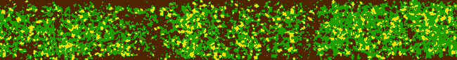
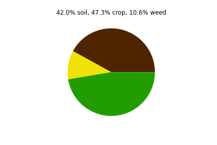
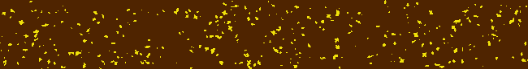

## Crops vs Weeds
This is part of the Machine Learning course project aimed to differentiate crops and weeds on the field separated by 2x38 beds. For this, 20m-high drone tiff images consisting of R,G,B,NIR,REG channels were provided. Below is brief description of the steps undertaken.

### Vegetation indices
The approach is based on vegetation indices. MEXG index is found to be well applicable for early-season images. Note that there is no universal index to cover the whole season.  

### KMeans clustering
KMeans clustering of the bed image transformed into MEXG was used to differentiate crops, weeds and soil.

This allows to indicate the amount of the weeds

### Thresholding and weed feature extracting
We used triangle threshold for bed's MEXG image to separate weeds from remaining part

Found connected regions have features like area, inertia tensor, perimeter etc used to create weeds database. This database was supplemented by the target feature Nitrogen rate known for the bed beforehand.

### Machine Learning
By collecting data on the weeds from whole field, the database with 20k rows were obtained, see `script_feature_extraction.py`. Since the weed grow rate has to be sensitive to Nitrogen fertilizers, the idea for machine learning is to predict Nitrogen from weeds features. For this, various classifiers were tested and GradientBoost showed the best performance.